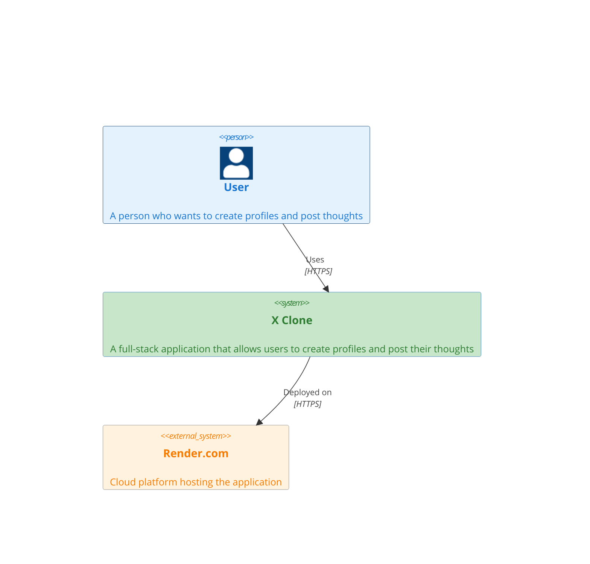
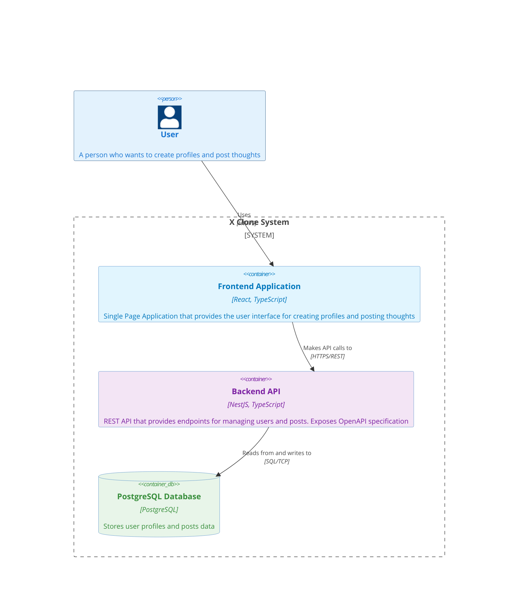

# X Clone

This is a demo full-stack application that allows users to create profiles and post their thoughts. It features:

- **User Profiles**: Manage user profiles with basic information (username, avatar placeholder);
- **Post Feed**: Manage posts made by users;

## Assumptions and Future Improvements

The project, to decrease its scope and considering its demo purpose, does not include important aspects which in a normal production-ready application would be expected, such as:

- **CI/CD pipeline**: a GitHub workflow for continuous integration, via running some tests and related quality assurance checks; the CD part of this project is managed by the [render](https://render.com/) platform;
- **Database migrations**: Managing the application state via database migrations;
- **REST API Client SDK**: for type checking purposes, it would be expected that the API provides it, so clients do not have to duplicate these type definitions;
- **Authentication**: Implement proper user authentication with token-based authentication managed by an identity provider;
- **End-to-end typing support**: Implement a setup where clients could automatically get updated typing references, which could be achieved by automatically generating types from the OpenAPI spec, or technologies like tRPC for instance;
- **Improve backend layering architecture**: as the system grows, potentially consider improving the application layering, extracting domain use-cases and removing the hard dependencies currently existent between the services and the infrastructure layer (typeORM), going closer to the principles established by the [hexagonal architecture](https://docs.aws.amazon.com/prescriptive-guidance/latest/cloud-design-patterns/hexagonal-architecture.html);
- **Content moderation**: proper handling for content moderation via a variety of techniques such as: machine learning classifiers, keyword and pattern matching, behavioral signals and so on;
- **Search**: full-text search for users and posts;
- **Pagination**: proper pagination and virtual scrolling in the frontend;
- **UX consistency**: extract reusable frontend component, reusable design system tokens and implement theming capabilities;
- **SSR**: consider server-side-rendering in the frontend application for improved SEO and user experience;
- **Real-time Updates**: WebSocket support for live feed (posts) updates;
- **Accessibility**: improve ARIA labels and keyboard navigation;
- **Testing**: expand test coverage;

## Architecture

### System Context Diagram



### Container Diagram



## Deployment

The deployment is managed by [https://render.com/](https://render.com/) free tier plan and are available respectively:

- the REST API: [https://x-clone-btx5.onrender.com/api](https://x-clone-btx5.onrender.com/api)
- the frontend application: [https://x-clone-frontend-5okj.onrender.com](https://x-clone-frontend-5okj.onrender.com)

## How to Run Locally

### Prerequisites

- Node.js (v18+)
- Docker and Docker Compose (optional, for containerized setup)

### Option 1: Local Development

1. **Start PostgreSQL** (if not using Docker):

   ```bash
   docker-compose up postgres -d
   ```

2. **Install dependencies**:

   ```bash
   npm install
   ```

3. **Start backend** (from project root):

   ```bash
   npm run start:backend
   ```

4. **Start frontend** (in a new terminal):

   ```bash
   npm run start:frontend
   ```

5. **Optional: Seed database**:
   ```bash
   npm run seed-backend
   ```

**Note**: Backend defaults to `localhost:5432` for PostgreSQL. Frontend defaults to `http://localhost:3000` for the API. Configure via environment variables if needed.

### Option 2: Using Docker Compose

```bash
docker-compose up
```

This starts PostgreSQL, backend API (http://localhost:3000), and frontend (http://localhost:5173). API docs available at http://localhost:3000/api.

## Technology Stack

### Backend

- **NestJS**: Progressive Node.js framework
- **TypeORM**: ORM for PostgreSQL
- **OpenAPI Spec**: REST API exposed via OpenAPI Specification
- **TypeScript**: Type-safe JavaScript
- **PostgreSQL**: Relational database

### Frontend

- **React**: UI library
- **TypeScript**: Type-safe JavaScript
- **Vite**: Build tool and dev server
- **React Router**: Declarative routing for React
- **TanStack Query**: Data fetching and caching
- **Tailwind CSS**: Utility-first CSS framework
